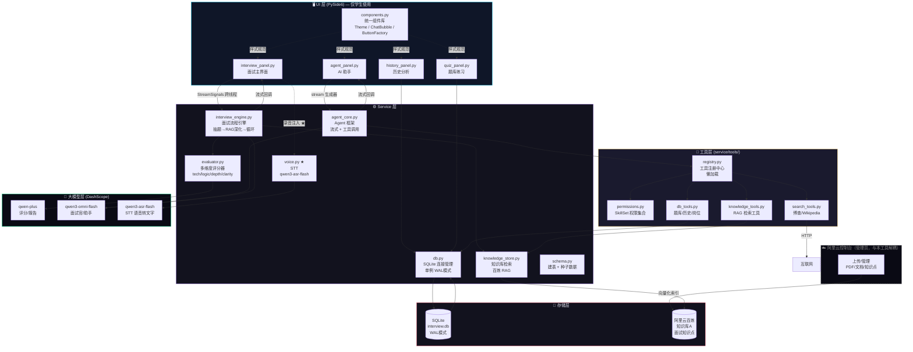
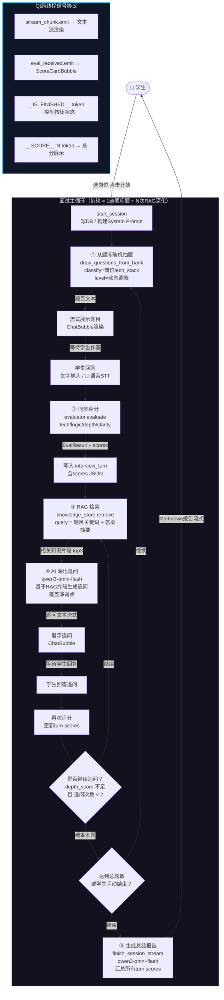
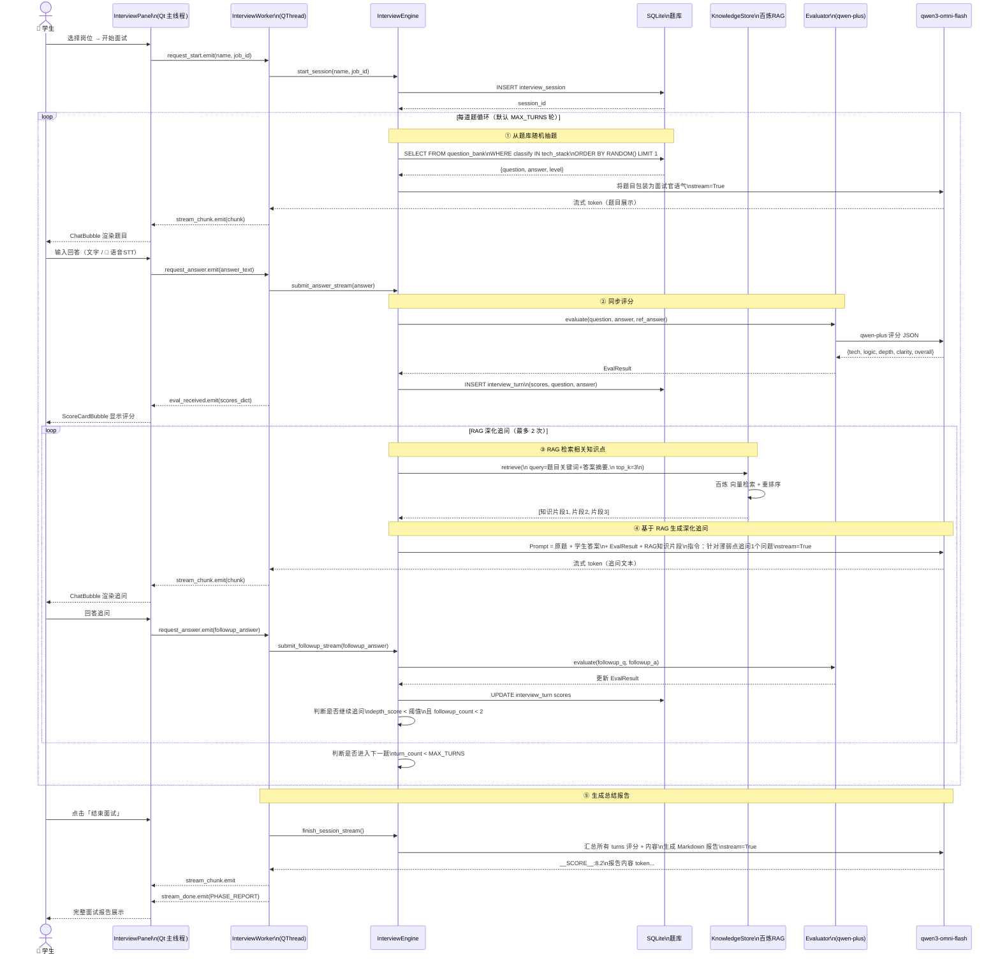
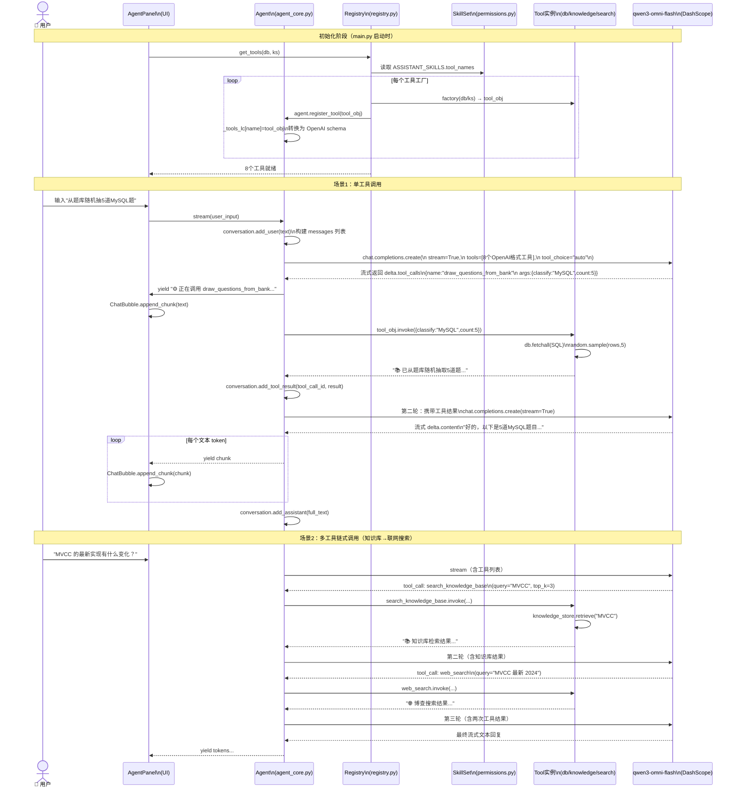
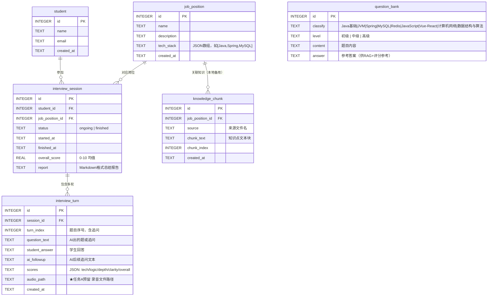
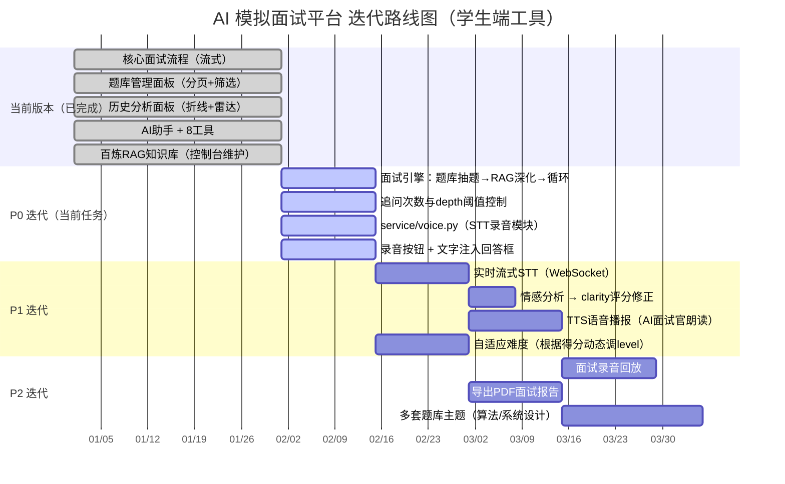

# 整体架构图

```mermaid
graph TB
    subgraph UILayer["🖥️ UI 层 (PySide6) — 仅学生使用"]
        IP[interview_panel.py\n面试主界面]
        QP[quiz_panel.py\n题库练习]
        HP[history_panel.py\n历史分析]
        AP[agent_panel.py\nAI 助手]
        COMP[components.py\n统一组件库\nTheme / ChatBubble / ButtonFactory]
    end

    subgraph SvcLayer["⚙️ Service 层"]
        AC[agent_core.py\nAgent 框架\n流式 + 工具调用]
        IE[interview_engine.py\n面试流程引擎\n抽题→RAG深化→循环]
        EV[evaluator.py\n多维度评分器\ntech/logic/depth/clarity]
        KS[knowledge_store.py\n知识库检索\n百炼 RAG]
        VO[voice.py ★\nSTT\nqwen3-asr-flash]
        DB2[db.py\nSQLite 连接管理\n单例 WAL模式]
        SC[schema.py\n建表 + 种子数据]
    end

    subgraph ToolsLayer["🔧 工具层 (service/tools/)"]
        REG[registry.py\n工具注册中心\n懒加载]
        PERM[permissions.py\nSkillSet 权限集合]
        DBT[db_tools.py\n题库/历史/岗位]
        KT[knowledge_tools.py\nRAG 检索工具]
        ST[search_tools.py\n博查/Wikipedia]
    end

    subgraph ModelLayer["🤖 大模型层 (DashScope)"]
        QP2[qwen-plus\n评分/报告]
        QO[qwen3-omni-flash\n面试官/助手]
        ASR[qwen3-asr-flash\nSTT 语音转文字]
    end

    subgraph StorageLayer["💾 存储层"]
        SQLITE[(SQLite\ninterview.db\nWAL模式)]
        BAILIAN[(阿里云百炼\n知识库A\n面试知识点)]
    end

    subgraph AdminLayer["☁️ 阿里云控制台（管理员，与本工具解耦）"]
        UPLOAD[上传/管理\nPDF/文档/知识点]
    end

    UPLOAD -->|向量化索引| BAILIAN

    IP -->|StreamSignals 跨线程| IE
    IE -->|流式回调| IP
    IP -.->|录音注入 ★| VO
    AP -->|stream 生成器| AC
    AC -->|流式回调| AP
    HP --> DB2
    QP --> DB2

    AC --> REG
    IE --> EV
    IE --> KS
    EV --> QP2
    AC --> QO
    IE --> QO
    VO --> ASR

    REG --> PERM
    REG --> DBT
    REG --> KT
    REG --> ST

    DBT --> DB2
    KT --> KS
    ST -->|HTTP| 互联网

    KS --> BAILIAN
    DB2 --> SQLITE
    SQLITE --> DB2

    COMP -.->|样式规范| IP
    COMP -.->|样式规范| AP
    COMP -.->|样式规范| HP
    COMP -.->|样式规范| QP

    style UILayer fill:#0F1628,stroke:#00D4FF,color:#E8E8F5
    style SvcLayer fill:#12121E,stroke:#B388FF,color:#E8E8F5
    style ToolsLayer fill:#1A1A2E,stroke:#FFD166,color:#E8E8F5
    style ModelLayer fill:#0A0A14,stroke:#00FF9D,color:#E8E8F5
    style StorageLayer fill:#12121E,stroke:#E94560,color:#E8E8F5
    style AdminLayer fill:#0A0A14,stroke:#888888,stroke-dasharray:6 3,color:#888888

```

# 面试数据流图

```mermaid
flowchart TD
    U([👤 学生]) -->|选岗位 点击开始| INIT

    subgraph LOOP_OUTER["面试主循环（每轮 = 1道题库题 + N次RAG深化）"]
        direction TB

        INIT[start_session\n写DB / 构建System Prompt] --> DRAW

        DRAW["① 从题库随机抽题\ndraw_questions_from_bank\nclassify=岗位tech_stack\nlevel=动态调整"]
        DRAW -->|题目文本| SHOW_Q[流式展示题目\nChatBubble渲染]
        SHOW_Q -->|等待学生作答| ANS

        ANS[学生回答\n文字输入 / 🎤 语音STT] --> EVAL

        EVAL["② 同步评分\nevaluator.evaluate\ntech/logic/depth/clarity"]
        EVAL -->|EvalResult + scores| SAVE_TURN[写入 interview_turn\n含scores JSON]

        SAVE_TURN --> RAG_QUERY

        RAG_QUERY["③ RAG 检索\nknowledge_store.retrieve\nquery = 题目关键词 + 答案摘要"]
        RAG_QUERY -->|相关知识片段 top3| LLM_DEEP

        LLM_DEEP["④ AI 深化追问\nqwen3-omni-flash\n基于RAG片段生成追问\n覆盖薄弱点"]
        LLM_DEEP -->|追问文本流式| SHOW_FOLLOW
        SHOW_FOLLOW[展示追问\nChatBubble] -->|等待学生回答| ANS2

        ANS2[学生回答追问] --> EVAL2
        EVAL2[再次评分\n更新turn scores] --> CHECK

        CHECK{是否继续追问？\ndepth_score 不足\n且 追问次数 < 2}
        CHECK -->|继续| RAG_QUERY
        CHECK -->|结束本题| NEXT_CHECK

        NEXT_CHECK{达到总题数\n或学生手动结束？}
        NEXT_CHECK -->|继续| DRAW
        NEXT_CHECK -->|结束| REPORT
    end

    REPORT["⑤ 生成总结报告\nfinish_session_stream\nqwen3-omni-flash\n汇总所有turn scores"]
    REPORT -->|Markdown报告流式| U

    subgraph SIGNALS["Qt跨线程信号协议"]
        S1[stream_chunk.emit → 文本流渲染]
        S2[eval_received.emit → ScoreCardBubble]
        S3[__IS_FINISHED__ token → 控制按钮状态]
        S4[__SCORE__:N token → 总分展示]
    end

    style LOOP_OUTER fill:#12121E,stroke:#B388FF,color:#E8E8F5
    style SIGNALS fill:#0F1628,stroke:#00D4FF,color:#E8E8F5
```

# 面试引擎完整时序图

```mermaid
sequenceDiagram
    actor S as 👤 学生
    participant UI as InterviewPanel\n(Qt 主线程)
    participant W as InterviewWorker\n(QThread)
    participant IE as InterviewEngine
    participant DB as SQLite\n题库
    participant KS as KnowledgeStore\n百炼RAG
    participant EV as Evaluator\n(qwen-plus)
    participant LLM as qwen3-omni-flash

    S->>UI: 选择岗位 → 开始面试
    UI->>W: request_start.emit(name, job_id)
    W->>IE: start_session(name, job_id)
    IE->>DB: INSERT interview_session
    DB-->>IE: session_id

    loop 每道题循环（默认 MAX_TURNS 轮）

        Note over IE,DB: ① 从题库随机抽题
        IE->>DB: SELECT FROM question_bank\nWHERE classify IN tech_stack\nORDER BY RANDOM() LIMIT 1
        DB-->>IE: {question, answer, level}
        IE->>LLM: 将题目包装为面试官语气\nstream=True
        LLM-->>W: 流式 token（题目展示）
        W-->>UI: stream_chunk.emit(chunk)
        UI-->>S: ChatBubble 渲染题目

        S->>UI: 输入回答（文字 / 🎤 语音STT）
        UI->>W: request_answer.emit(answer_text)
        W->>IE: submit_answer_stream(answer)

        Note over IE,EV: ② 同步评分
        IE->>EV: evaluate(question, answer, ref_answer)
        EV->>LLM: qwen-plus 评分 JSON
        LLM-->>EV: {tech, logic, depth, clarity, overall}
        EV-->>IE: EvalResult
        IE->>DB: INSERT interview_turn\n(scores, question, answer)
        W-->>UI: eval_received.emit(scores_dict)
        UI-->>S: ScoreCardBubble 显示评分

        loop RAG 深化追问（最多 2 次）

            Note over IE,KS: ③ RAG 检索相关知识点
            IE->>KS: retrieve(\n  query=题目关键词+答案摘要,\n  top_k=3\n)
            KS->>KS: 百炼 向量检索 + 重排序
            KS-->>IE: [知识片段1, 片段2, 片段3]

            Note over IE,LLM: ④ 基于 RAG 生成深化追问
            IE->>LLM: Prompt = 原题 + 学生答案\n+ EvalResult + RAG知识片段\n指令：针对薄弱点追问1个问题\nstream=True
            LLM-->>W: 流式 token（追问文本）
            W-->>UI: stream_chunk.emit(chunk)
            UI-->>S: ChatBubble 渲染追问

            S->>UI: 回答追问
            UI->>W: request_answer.emit(followup_answer)
            W->>IE: submit_followup_stream(followup_answer)
            IE->>EV: evaluate(followup_q, followup_a)
            EV-->>IE: 更新 EvalResult
            IE->>DB: UPDATE interview_turn scores

            IE->>IE: 判断是否继续追问\ndepth_score < 阈值\n且 followup_count < 2

        end

        IE->>IE: 判断是否进入下一题\nturn_count < MAX_TURNS

    end

    Note over W,LLM: ⑤ 生成总结报告
    S->>UI: 点击「结束面试」
    W->>IE: finish_session_stream()
    IE->>LLM: 汇总所有 turns 评分 + 内容\n生成 Markdown 报告\nstream=True
    LLM-->>W: __SCORE__:8.2\n报告内容 token...
    W-->>UI: stream_chunk.emit
    W-->>UI: stream_done.emit(PHASE_REPORT)
    UI-->>S: 完整面试报告展示
```

# Agent×SkillSet工具调用时序图

```mermaid
sequenceDiagram
    actor User as 👤 用户
    participant AP as AgentPanel\n(UI)
    participant AG as Agent\n(agent_core.py)
    participant REG as Registry\n(registry.py)
    participant PERM as SkillSet\n(permissions.py)
    participant TOOL as Tool实例\n(db/knowledge/search)
    participant LLM as qwen3-omni-flash\n(DashScope)

    Note over User,LLM: 初始化阶段（main.py 启动时）
    AP->>REG: get_tools(db, ks)
    REG->>PERM: 读取 ASSISTANT_SKILLS.tool_names
    loop 每个工具工厂
        REG->>TOOL: factory(db/ks) → tool_obj
        REG->>AG: agent.register_tool(tool_obj)
        AG->>AG: _tools_lc[name]=tool_obj\n转换为 OpenAI schema
    end
    REG-->>AP: 8个工具就绪

    Note over User,LLM: 场景1：单工具调用
    User->>AP: 输入"从题库随机抽5道MySQL题"
    AP->>AG: stream(user_input)
    AG->>AG: conversation.add_user(text)\n构建 messages 列表

    AG->>LLM: chat.completions.create(\n  stream=True,\n  tools=[8个OpenAI格式工具],\n  tool_choice="auto"\n)
    LLM-->>AG: 流式返回 delta.tool_calls\n{name:"draw_questions_from_bank"\n args:{classify:"MySQL",count:5}}

    AG->>AP: yield "⚙️ 正在调用 draw_questions_from_bank..."
    AP->>AP: ChatBubble.append_chunk(text)

    AG->>TOOL: tool_obj.invoke({classify:"MySQL",count:5})
    TOOL->>TOOL: db.fetchall(SQL)\nrandom.sample(rows,5)
    TOOL-->>AG: "📚 已从题库随机抽取5道题..."

    AG->>AG: conversation.add_tool_result(tool_call_id, result)

    AG->>LLM: 第二轮：携带工具结果\nchat.completions.create(stream=True)
    LLM-->>AG: 流式 delta.content\n"好的，以下是5道MySQL题目..."

    loop 每个文本 token
        AG-->>AP: yield chunk
        AP->>AP: ChatBubble.append_chunk(chunk)
    end

    AG->>AG: conversation.add_assistant(full_text)

    Note over User,LLM: 场景2：多工具链式调用（知识库→联网搜索）
    User->>AP: "MVCC 的最新实现有什么变化？"
    AG->>LLM: stream（含工具列表）

    LLM-->>AG: tool_call: search_knowledge_base\n(query="MVCC", top_k=3)
    AG->>TOOL: search_knowledge_base.invoke(...)
    TOOL->>TOOL: knowledge_store.retrieve("MVCC")
    TOOL-->>AG: "📚 知识库检索结果..."

    AG->>LLM: 第二轮（含知识库结果）
    LLM-->>AG: tool_call: web_search\n(query="MVCC 最新 2024")
    AG->>TOOL: web_search.invoke(...)
    TOOL-->>AG: "🌐 博查搜索结果..."

    AG->>LLM: 第三轮（含两次工具结果）
    LLM-->>AG: 最终流式文本回复
    AG-->>AP: yield tokens...
```

# 数据库er图

```mermaid
erDiagram
    student {
        INTEGER id PK
        TEXT name
        TEXT email
        TEXT created_at
    }

    job_position {
        INTEGER id PK
        TEXT name
        TEXT description
        TEXT tech_stack "JSON数组，如[Java,Spring,MySQL]"
        TEXT created_at
    }

    interview_session {
        INTEGER id PK
        INTEGER student_id FK
        INTEGER job_position_id FK
        TEXT status "ongoing | finished"
        TEXT started_at
        TEXT finished_at
        REAL overall_score "0-10 均值"
        TEXT report "Markdown格式总结报告"
    }

    interview_turn {
        INTEGER id PK
        INTEGER session_id FK
        INTEGER turn_index "题目序号，含追问"
        TEXT question_text "AI出的题或追问"
        TEXT student_answer "学生回答"
        TEXT ai_followup "AI后续追问文本"
        TEXT scores "JSON: tech/logic/depth/clarity/overall"
        TEXT audio_path "★任务A预留 录音文件路径"
        TEXT created_at
    }

    question_bank {
        INTEGER id PK
        TEXT classify "Java基础|JVM|Spring|MySQL|Redis|JavaScript|Vue-React|计算机网络|数据结构与算法"
        TEXT level "初级 | 中级 | 高级"
        TEXT content "题目内容"
        TEXT answer "参考答案（供RAG+评分参考）"
    }

    knowledge_chunk {
        INTEGER id PK
        INTEGER job_position_id FK
        TEXT source "来源文件名"
        TEXT chunk_text "知识点文本块"
        INTEGER chunk_index
        TEXT created_at
    }

    student ||--o{ interview_session : "参加"
    job_position ||--o{ interview_session : "对应岗位"
    interview_session ||--o{ interview_turn : "包含多轮"
    job_position ||--o{ knowledge_chunk : "关联知识（本地备用）"
```

# 迭代路线

```mermaid
gantt
    title AI 模拟面试平台 迭代路线图（学生端工具）
    dateFormat  YYYY-MM-DD
    axisFormat  %m/%d

    section 当前版本（已完成）
    核心面试流程（流式）              :done, core,  2025-01-01, 2025-02-01
    题库管理面板（分页+筛选）         :done, quiz,  2025-01-01, 2025-02-01
    历史分析面板（折线+雷达）         :done, hist,  2025-01-01, 2025-02-01
    AI助手 + 8工具                    :done, agent, 2025-01-01, 2025-02-01
    百炼RAG知识库（控制台维护）       :done, rag,   2025-01-01, 2025-02-01

    section P0 迭代（当前任务）
    面试引擎：题库抽题→RAG深化→循环  :active, loop, 2025-02-01, 14d
    追问次数与depth阈值控制           :active, dep,  2025-02-01, 14d
    service/voice.py（STT录音模块）   :active, va,   2025-02-01, 14d
    录音按钮 + 文字注入回答框         :active, vb,   2025-02-01, 14d

    section P1 迭代
    实时流式STT（WebSocket）          :p1a, after va,   14d
    情感分析 → clarity评分修正        :p1b, after p1a,   7d
    TTS语音播报（AI面试官朗读）       :p1c, after p1a,  14d
    自适应难度（根据得分动态调level） :p1d, after loop, 14d

    section P2 迭代
    面试录音回放                      :p2a, after p1c,  14d
    导出PDF面试报告                   :p2b, after p1d,  14d
    多套题库主题（算法/系统设计）     :p2c, after p2b,  21d
```